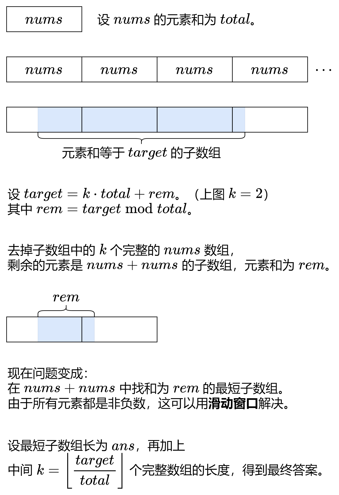

# 不定长滑动窗口

三类：求最长子数组    求最短子数组  求子数组个数

## 越短越合法/求最长/最大

题目套路：求最长子串，通过一些限制条件使得子串越短越符合条件如：“不重复”“某元素个数不超过”等，经常结合hashmap或者set来完成

典型题目：

* [3.无重复字符的最长字串](https://leetcode.cn/problems/longest-substring-without-repeating-characters/description/)
* [3090.每个字符最多出现两次的最长字符串](https://leetcode.cn/problems/maximum-length-substring-with-two-occurrences/description/)

伪代码模板：

```cpp
{
	int n = array.size();
	int ans = 0;
	int left = 0;
	for (int right = 0; right < n; right++) {
		//窗口右侧开始向右扩展
		if (array[right]满足什么条件) {
			unordered_map来记录
		}

		//字串已经不满足条件开始收缩左侧
		while (字串满足什么条件) {   //当此时的字串一般达到一定长度但是开始不满足题目条件，所以开始收缩左侧
			if(array[left]满足什么条件) {
				进行修改；
			}
			left++；
		}

		//记录符合条件的最长字串
		ans = max(ans, right - left + 1);
	}
	return ans;
}
```

## 越长越合法/求最短/最小

题目套路：求满足条件的长度最小子串，越长越符合条件 如：“元素和达到某个target”“替换子串...”

典型题目：

* [最小覆盖子串(hard)](https://leetcode.cn/problems/minimum-window-substring/description/)
* [最小区间(hard)](https://leetcode.cn/problems/smallest-range-covering-elements-from-k-lists/description/)

note: 有时候题目会问从两头取子串，等价于去掉一个中间的子串。此时我们可以通过对left和right进行取模的操作来模拟像是两个相同的数组取尾部和头部。

典型例题：[无限数组的最短子数组](https://leetcode.cn/problems/minimum-size-subarray-in-infinite-array/description/)



## 求子数组个数

求子数组个数的关键点在于个数的求法，不同情况有差异

### 越短越合法

一般要写 `ans += right - left + 1`

即内层循环结束的标志是右端点固定情况下左端点到右端点最长合法

内层循环结束后，[left,right] 这个子数组是满足题目要求的。由于子数组越短，越能满足题目要求，所以除了 [left,right]，还有 [left+1,right],[left+2,right],…,[right,right] 都是满足要求的。也就是说，当右端点固定在 right 时，左端点在 left,left+1,left+2,…,right 的所有子数组都是满足要求的，这一共有 right−left+1 个。

典型题目：

* [713. 乘积小于 K 的子数组](https://leetcode.cn/problems/subarray-product-less-than-k/description/)
* [2302. 统计得分小于 K 的子数组数目](https://leetcode.cn/problems/count-subarrays-with-score-less-than-k/description/)

### 越长越合法

一般要写 `ans += left`

内层循环结束后，[left,right] 这个子数组是不满足题目要求的，但在退出循环之前的最后一轮循环，[left−1,right] 是满足题目要求的。由于子数组越长，越能满足题目要求，所以除了 [left−1,right]，还有 [left−2,right],[left−3,right],…,[0,right] 都是满足要求的。也就是说，当右端点固定在 right 时，左端点在 0,1,2,…,left−1 的所有子数组都是满足要求的，这一共有 left 个。

我们关注的是 left−1 的合法性，而不是 left。

典型题目：

* [2799. 统计完全子数组的数目](https://leetcode.cn/problems/count-complete-subarrays-in-an-array/description/)
* [3298. 统计重新排列后包含另一个字符串的子字符串数目 II(hard)](https://leetcode.cn/problems/count-substrings-that-can-be-rearranged-to-contain-a-string-ii/description/)
