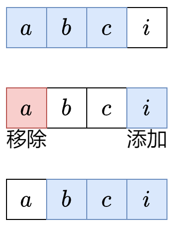

# 定长滑窗

题目特征：
在连续空间进行即数组或字符串，同时题目给定了滑窗的长度k
一般提问在长度为k的字串中最多包含多少符合条件的元素



**套路**
窗口右端点在 **i** 时，由于窗口长度为 **k**，所以左端点为 **i - k + 1。**

总结为三步：**入-更新-出**

1. **入**：下标为 i 的元素进入窗口，更新相关统计量。若窗口左端点 i - k + 1 < 0，则尚未形成第一个窗口，重复第一步。
2. **更新**：更新答案（一般是最大值/最小值）。
3. **出**：下标为 i - k + 1 的元素离开窗口，更新相关统计量，为下一个循环做准备。

#### 伪代码

```C++
for(int right = 0; right < array.size(); right++) {  //枚举窗口右端点right
	//1.右端点进入窗口
	if(array[right]满足某个条件) {
		num++;
	}

	int left = i - k + 1;  //窗口左端点
	if (left < 0) {//窗口大小不足k，尚未形成第一个窗口
		continue;
	}

	//2.更新答案
	ans = max(ans, num);

	//3.左端点离开窗口，为下一个循环做准备
	if(array[left]满足某个条件){
		num--;
	}
}
```
